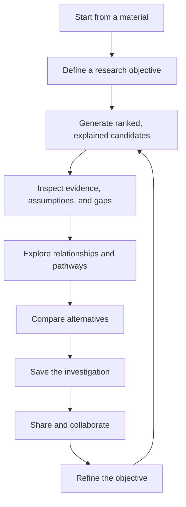
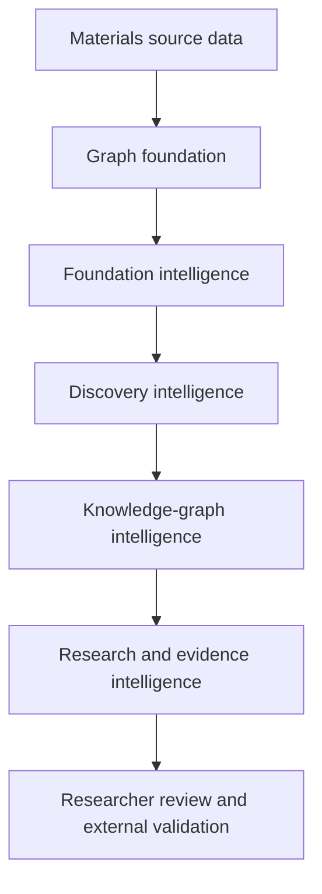

# MaterialGraph

> Deterministic, explainable materials research intelligence and decision
> support

MaterialGraph is an open-source knowledge-graph platform that computationally
generates, ranks, compares, and explains material opportunities using available
data and explicit deterministic rules.

MaterialGraph is a research-assistance system. Its outputs are hypotheses and
prioritization signals—not proof of novelty, structural preservation,
transformation or synthesis feasibility, physical performance, or scientific
correctness. Researchers retain responsibility for interpretation and must
validate relevant conclusions through literature, structural analysis,
domain-specific computation, experiments, or other appropriate methods.

In this project, **discovery** means deterministic computational exploration
and prioritization. It does not mean experimental discovery, novelty
confirmation, synthesis feasibility, or validated performance.

---

## Why MaterialGraph?

Materials research requires investigators to compare chemistry, stability,
criticality, supply risk, evidence, and competing research constraints.

MaterialGraph helps users:

- find computationally related material opportunities;
- explore inspectable substitution and pathway hypotheses;
- analyze graph relationships and communities;
- evaluate research objectives and constraints;
- compare strengths, trade-offs, warnings, and assumptions;
- identify missing evidence and validation priorities.

It does not autonomously select a scientifically correct material or pathway.

---

## The MaterialGraph Research Cycle

MaterialGraph is designed as an explainable scientific exploration workspace,
not as a collection of disconnected endpoints or isolated analysis tools. A
researcher should be able to move through one continuous investigation:



The cycle is iterative because scientific exploration rarely ends with one
ranking or comparison. Each result should help the researcher refine the
question, inspect another possibility, or identify the next validation step.

---

## Core Principles

- deterministic and reproducible computation;
- explicit data, rules, scoring, provenance, and limitations;
- researcher-in-the-loop decision support;
- structured data before inferred representations;
- unknown evidence is not favourable evidence;
- internal model support is not external scientific validation;
- scientific and graph semantics before performance;
- no LLM reasoning in canonical scientific computation.

Given the same inputs, source-data version, configuration, software version, and
ordering rules, MaterialGraph should produce the same ordered outputs and
explanations. Determinism makes results reproducible; it does not make them
scientifically valid.

---

## Current Capabilities — v1.9.6

### Foundation Intelligence

- Material Graph Foundation;
- Material Neighborhood and Family Intelligence;
- Similarity and Recommendation Engines;
- Criticality Analysis;
- Scenario Policy Engine.

### Discovery Intelligence

- Discovery Candidate Engine;
- Explainable Discovery Scoring and Warnings;
- Substitution Path Engine;
- Multi-Hop Discovery Chains;
- Discovery Path Ranking;
- Research-Objective Exploration.

### Knowledge-Graph Intelligence

- Graph Builder and Traversal;
- BFS, DFS, Dijkstra, and K-best path workflows;
- Community Detection and Intelligence;
- Ranked Subgraph Exploration;
- Graph Analytics;
- Material Quality;
- Node and Edge Intelligence;
- PostgreSQL-backed graph-job routes and persistence.

### Research and Evidence Intelligence

- Scientific Pathway Analysis;
- Research Opportunity Analysis;
- Objective Evaluation;
- Comparative Research Intelligence;
- Endpoint-Sensitive Research Ranking;
- Structured Evidence Summaries and Attribution;
- Missing-Evidence and Weak-Assumption Reporting;
- Validation Priorities and Evidence Readiness.

These capabilities are implemented and partly tested. “Implemented” does not
mean independently scientifically validated.

---

## Interpreting Research Outputs

MaterialGraph distinguishes:

| Output category | Meaning |
|---|---|
| Source data | Imported or recorded fields such as composition and source identifiers |
| Derived measurement | Deterministically calculated values such as criticality or centrality |
| Rule-based inference | Classifications and pathway hypotheses produced by encoded rules |
| External validation evidence | Literature, structural analysis, DFT, synthesis, or experimental results |

Confidence and readiness fields describe support within MaterialGraph's current
data and rules. They are not probabilities of scientific correctness.

The platform should separately expose internal rule support, data completeness,
external evidence coverage, validation readiness, and scientific-validation
status. A pathway can have strong internal support while having no external
validation evidence.

Objectives distinguish preferences, soft constraints, hard endpoint
constraints, and hard path-wide constraints. Unknown evidence cannot be assumed
to satisfy a hard constraint unless explicitly permitted.

---

## Architecture



The planned Scientific Knowledge Layer will preserve attributed literature,
observations, simulations, experiments, review status, and disagreement.
Evidence will not silently alter canonical computation; reviewed evidence may
enter later, explicitly versioned datasets or policies.

---

## Current Validation and Audit Status

| Validation type | Status |
|---|---|
| Unit and regression testing | Implemented; coverage continues to expand |
| API and deterministic-behaviour verification | Completed for tested workflows |
| Architecture and implementation audit | Reconciled; remediation in progress |
| Literature-backed case studies | Not yet completed |
| Independent materials-researcher review | Not yet completed |
| DFT cross-validation | Not yet completed |
| Experimental validation | Not completed |

The reconciled canonical audit register currently tracks 94 findings: 23 are
resolved within their documented engineering scope and 71 remain open or
require policy decisions.

“Resolved” means that a specified implementation defect was corrected and
verified within scope. It does not mean that the affected output has been
scientifically validated.

---

## Technology Stack

### Backend

- Python;
- FastAPI;
- SQLAlchemy;
- Pydantic v2;
- PostgreSQL;
- Alembic;
- NetworkX.

### Infrastructure

- AWS EC2;
- Neon PostgreSQL;
- Nginx;
- systemd;
- Docker for local development.

### Testing

- pytest.

---

## Quick Start

```bash
git clone https://github.com/MaterialGraph/materialgraph.git
cd materialgraph

python -m venv .venv
pip install -r requirements.txt

alembic upgrade head
python scripts/import_materials_project.py

uvicorn app.main:app --reload
```

---

## Documentation

| Document | Description |
|---|---|
| [Getting Started](docs/guide/getting_started.md) | Local setup and project bootstrapping |
| [System Architecture](docs/architecture/system_architecture.md) | Implemented layers and cross-cutting architecture |
| [Scientific Principles](docs/architecture/scientific_principles.md) | Governing scientific and evidence boundaries |
| [Research Architecture](docs/architecture/research_architecture.md) | Researcher workflow and validation responsibilities |
| [Roadmap](docs/architecture/roadmap.md) | Remediation, validation, and future milestones |
| [Known Issues](docs/guide/technical_notes.md) | Current limitations and tracked issues |
| [Deployment Guide](docs/development/deployment.md) | AWS EC2, Neon PostgreSQL, systemd, and Nginx deployment |
| [Security Documentation](docs/security/README.md) | Security architecture and implementation plan |

---

## Roadmap Priorities

1. Remediate scientific-correctness and unknown-risk findings.
2. Correct graph, traversal, path, objective, and evidence semantics.
3. Harden graph-job concurrency, ownership, authorization, and API contracts.
4. Bound graph-search cost and remove query amplification.
5. Establish literature-backed cases and independent researcher review.
6. Add governed evidence capture and a versioned Scientific Knowledge Layer.
7. Introduce Go or Rust computation only where profiling justifies it.
8. Explore ML or LLM assistance without replacing canonical deterministic
   computation.

See the [roadmap](docs/architecture/roadmap.md) for status definitions and the
full sequence.

---

## Project Scope

MaterialGraph does not:

- replace literature review or domain expertise;
- prove structural or framework preservation;
- replace crystallographic analysis, DFT, or other domain computation;
- guarantee transformation or synthesis feasibility;
- guarantee material performance or industrial scalability;
- replace laboratory experiments, peer review, or scientific judgment.

Researchers remain responsible for selecting, interpreting, and validating
research opportunities.

---

## License

MIT License